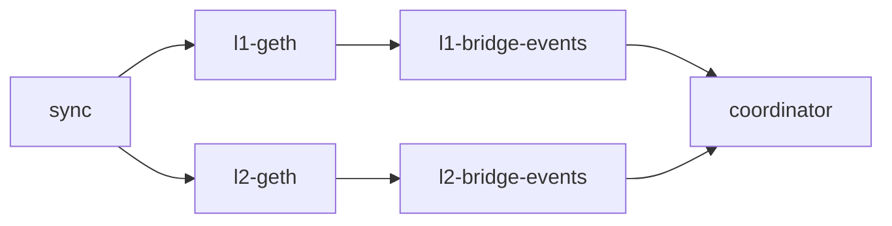
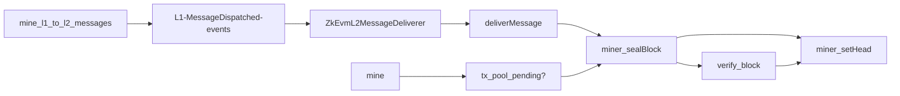

### Testnet Setup
The testnet setup consists of 6 entities where 2 of them are stateful (L1 node - 'upstream', L2 node - zkevm).
The Ethereum accounts for L1/L2 Clique Block Producer and management tasks like cross chain message forwarding are done via the
`MINER_PRIV_KEY` that has to be provided along `MINER_ADDRESS` - the Ethereum adress of that private key, in the `.env` file, see [.env.example][env-example] for guidance.

###### leader-testnet-geth
The stateful L2 node `leader-testnet-geth` is used for block sealing and in general used for all L2 data that the `coordinator` needs.
If changes are made to the [L2 Genesis Template][l2-genesis-template] then the L2 chain has to be initialized from scratch.

###### server-testnet-geth
Volatile geth nodes that sync from `leader-testnet-geth` to serve JSON-RPC requests coming from the `coordinator`.
This entity can be dynamically scaled down or up and the `coordinator` checks the healthiness at periodic intervals and forwards requests to these nodes at random.
The `coordinator` periodically queries the Docker DNS service to get a list of active instances and maintains that list accordingly.

###### l1-testnet-geth
This node resembles the upstream or mainnet node and contains the relevant L1 Bridge contract(s) for zkEVM.
If changes are made to the [L1 Genesis Template][l1-genesis-template] then the L1 chain has to be initialized from scratch.

###### coordinator
This daemon handles all relevant tasks:
- sealing L2 blocks
- submitting L2 blocks to L1 bridge
- requesting/computing proofs and finalizing L2 blocks on the L1 bridge
- Execution of L2 to L1 and L1 to L2 cross chain messages.
- Checking the healthiness and forwarding L2 JSON-RPC requests to a set of `server-testnet-geth` nodes.

###### web
Serves the hop-protocol webapp and provides proxies at the following paths via nginx:
- `/rpc/l1` to `l1-testnet-geth`
- `/rpc/l2` to `coordinator` that in turn chooses a replica of `server-testnet-geth` at random.

### Layer 1 - Bridge

The [`ZkEvmL1Bridge`][ZkEvmL1Bridge] is responsible for
- submission and finalisation of L2 blocks
- cross chain messaging

Sending messages and/or ETH to L2 requires calling [`dispatchMessage`][IZkEvmMessageDispatcher] on the [`ZkEvmL1Bridge`][ZkEvmL1Bridge].

Receiving messages from L2 to L1 requires waiting until the corresponding L2 block that includes the given message is finalized on L1 and then calling
[`deliverMessageWithProof`][IZkEvmMessageDelivererWithProof] on the L1 bridge.

Messages can also be dropped to reclaim ETH if they exceed the message `deadline` via [`dropMessage`][IZkEvmMessageDispatcher].

###### Addresses on L1 testnet
- [`ZkEvmL1Bridge`][ZkEvmL1Bridge]
  - `936a70c0b28532aa22240dce21f89a8399d6ac60`
- [`L1OptimismBridge`][L1OptimismBridge] - A Optimisms `ICrossDomainMessenger` compatibility contract
  - `936a70c0b28532aa22240dce21f89a8399d6ac61`

### Layer 2 - Bridge

There are two zkEVM related bridge contracts on L2:

- [`ZkEvmL2MessageDeliverer`][ZkEvmL2MessageDeliverer]
  - `0000000000000000000000000000000000010000`
- [`ZkEvmL2MessageDispatcher`][ZkEvmL2MessageDispatcher]
  - `0000000000000000000000000000000000020000`

The `ZkEvmL2MessageDeliverer` is responsible for processing messages from L1 to L2 and holds `uint256(-1)` ETH to allow for deposits to happen in regular transactions.
Messages from L2 to L1 can be invoked via calling [`dispatchMessage`][IZkEvmMessageDispatcher] on [`ZkEvmL2MessageDispatcher`][ZkEvmL2MessageDispatcher]. A message can be delivered on L1 via `deliverMessageWithProof` once the transaction was included in a L2 Block and finalized on L1.

**Note**: The Coordinator **MUST** make sure that no transaction to the `ZkEvmL2MessageDeliverer` is made in regular L2 Blocks. It's the responsibility of the Coordinator to build blocks with [`deliverMessage`][IZkEvmMessageDelivererWithoutProof] on [`ZkEvmL2MessageDeliverer`][ZkEvmL2MessageDeliverer]. This **MUST** also be enforced on the [`ZkEvmL1Bridge`][ZkEvmL1Bridge].

### Layer 2 - go-ethereum

The [geth fork][geth-fork] aims to be even with - or as close as possible to upstream.
The zkEVM fork option depends on [Berlin](https://github.com/ethereum/execution-specs/blob/master/network-upgrades/mainnet-upgrades/berlin.md)
and disables:
- [EIP-2718: Typed Transaction Envelope](https://eips.ethereum.org/EIPS/eip-2718)
- [EIP-2930: Optional access lists](https://eips.ethereum.org/EIPS/eip-2930)

In addition, zkEVM enables these EIPs included in `london`:
- [EIP-3541: Reject new contracts starting with the 0xEF byte](https://eips.ethereum.org/EIPS/eip-3541)
- [EIP-3529: Reduction in refunds](https://eips.ethereum.org/EIPS/eip-3529)

The zkEVM runs on the `Clique` consensus with one single proposer and the block submission to `ZkEvmL1Bridge` is permissioned.
**TBD**
Additionaly, only partial data of each L2 Block is submitted on L1 and therefore the data availability is weak.

###### Resources
- https://github.com/ethereum/execution-specs/blob/master/network-upgrades/mainnet-upgrades/

### Layer 2 - Additional JSON-RPC methods
- `miner_init`
  - initializes the miner without starting mining tasks
- `miner_setHead` [blockHash]
  - updates the canonical chain and announces the block on the p2p layer
- `miner_sealBlock` [{ parent, random, timestamp, transactions }]
  - mines and seals a block without changing the canonical chain.
    If `transactions` is not nil then produces a block with only those transactions. If nil, then it consumes from the transaction pool.
    Returns the block if successful.

### Layer 2 - Genesis Contracts
- [zkEVM Layer 2 Message Deliverer][ZkEvmL2MessageDeliverer]
  - `0000000000000000000000000000000000010000`
- [zkEVM Layer 2 Message Dispatcher][ZkEvmL2MessageDispatcher]
  - `0000000000000000000000000000000000020000`
- [Optimism WETH9](https://optimistic.etherscan.io/address/0x4200000000000000000000000000000000000006)
  - `4200000000000000000000000000000000000006`
- [Optimism L2CrossDomainMessenger](https://optimistic.etherscan.io/address/0x4200000000000000000000000000000000000007)
  - `4200000000000000000000000000000000000007`
- [Optimism L2StandardBridge](https://optimistic.etherscan.io/address/0x4200000000000000000000000000000000000010)
  - `4200000000000000000000000000000000000010`

###### Resources
- [EIP-1352: Specify restricted address range for precompiles/system contracts](https://eips.ethereum.org/EIPS/eip-1352)
- https://github.com/ethereum-optimism/optimism/tree/develop/packages/contracts/deployments/mainnet#readme

### Layer 2 - ETH genesis allocations
- `L2_CLIQUE_PROPOSER` (0.1 ETH) as initial balance to allow for deposits to be delivered.
  **The ZkEvmL1Bridge **MUST** hold the initial amount to account for the L2 balance of the L2_CLIQUE_PROPOSER**
  - `0x000000000000000000000000000000000000000000000000016345785d8a0000`
- `ZkEvmL2MessageDeliverer` - `uint256(-1)` minus the initial balance for `L2_CLIQUE_PROPOSER`
  - `0xfffffffffffffffffffffffffffffffffffffffffffffffffe9cba87a275ffff`

### Coordinator
The Coordinator has the following responsibilities:
- Keeping track of `ZkEvmL1Bridge`, `ZkEvmL2MessageDeliverer` and `ZkEvmL2MessageDispatcher` events.
- Importing any missing data to the L2 nodes. **TBD**
- Mining new blocks and setting the canonical chain head.
- Relaying L1 to L2 and L2 to L1 messages.
- Computing proofs for L2 Blocks.
- Submitting and finalizing L2 blocks on the `ZkEvmL1Bridge`.
- Acts as a round-robin proxy to serve JSON-RPC over a set of healthy l2-nodes.

###### Syncing Phase

###### Mining Phase

[IZkEvmMessageDispatcher]: ../contracts/interfaces/IZkEvmMessageDispatcher.sol
[ZkEvmL2MessageDispatcher]: ../contracts/ZkEvmL2MessageDispatcher.sol
[ZkEvmL2MessageDeliverer]: ../contracts/ZkEvmL2MessageDeliverer.sol
[IZkEvmMessageDelivererWithProof]: ../contracts/interfaces/IZkEvmMessageDelivererWithProof.sol
[IZkEvmMessageDelivererWithoutProof]: ../contracts/interfaces/IZkEvmMessageDelivererWithoutProof.sol
[ZkEvmL1Bridge]: ../contracts/ZkEvmL1Bridge.sol
[l1-genesis-template]: ../docker/geth/templates/l1-testnet.json
[l2-genesis-template]: ../docker/geth/templates/l2-testnet.json
[env-example]: ../.env.example
[L1OptimismBridge]: ../contracts/optimism/L1OptimismBridge.sol
[geth-fork]: https://github.com/privacy-scaling-explorations/go-ethereum
