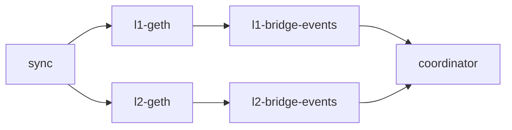
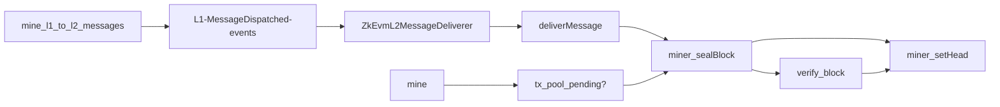

### Layer 1 - Bridge

The `ZkEvmL1Bridge` is responsible for
- submission and finalisation of L2 blocks
- cross chain messaging

Sending messages and/or ETH to L2 requires calling [`dispatchMessage`](TODO) on the `ZkEvmL1Bridge`.

Receiving messages from L2 to L1 requires waiting until the corresponding L2 block that includes the given message is finalized on L1 and then calling
[`deliverMessageWithProof`](TODO) on the L1 bridge.

Messages can also be dropped to reclaim ETH if they exceed the message `deadline` via [`dropMessage`](TODO).

###### Addresses on L1 testnet
- [`ZkEvmL1Bridge`](https://github.com/appliedzkp/zkevm-chain/blob/master/contracts/ZkEvmL1Bridge.sol)
  - `936a70c0b28532aa22240dce21f89a8399d6ac60`
- [`L1OptimismBridge`](https://github.com/appliedzkp/zkevm-chain/blob/master/contracts/optimism/L1OptimismBridge.sol) - A Optimisms `ICrossDomainMessenger` compatibility contract
  - `936a70c0b28532aa22240dce21f89a8399d6ac61`

### Layer 2 - Bridge

There are two zkEVM related bridge contracts on L2:

- [`ZkEvmL2MessageDeliverer`](https://github.com/appliedzkp/zkevm-chain/blob/master/contracts/ZkEvmL2MessageDeliverer.sol)
  - `0000000000000000000000000000000000010000`
- [`ZkEvmL2MessageDispatcher`](https://github.com/appliedzkp/zkevm-chain/blob/master/contracts/ZkEvmL2MessageDispatcher.sol)
  - `0000000000000000000000000000000000020000`

The `ZkEvmL2MessageDeliverer` is responsible for processing messages from L1 to L2 and holds `uint256(-1)` ETH to allow for deposits to happen in regular transactions.
Messages from L2 to L1 can be invoked via calling [`deliverMessage`](TODO) on `ZkEvmL2MessageDispatcher`. A message can be delivered on L1 via `deliverMessageWithProof` once the transaction was included in a L2 Block and finalized on L1.

**Note**: The Coordinator **MUST** make sure that no transaction to the `ZkEvmL2MessageDeliverer` is made in regular L2 Blocks. It's the responsibility of the Coordinator to build blocks with `deliverMessage` on `ZkEvmL2MessageDispatcher`. This **MUST** also be enforced on the `ZkEvmL1Bridge`.

### Layer 2 - go-ethereum

The [geth fork](https://github.com/appliedzkp/go-ethereum) aims to be even with - or as close as possible to upstream.
The zkEVM fork option includes the same EIPs as
[Arrow Glacier](https://github.com/ethereum/execution-specs/blob/master/network-upgrades/mainnet-upgrades/arrow-glacier.md)
**except**:
- [EIP-1559: Fee market change for ETH 1.0 chain](https://eips.ethereum.org/EIPS/eip-1559)
- [EIP-2718: Typed Transaction Envelope](https://eips.ethereum.org/EIPS/eip-2718)
- [EIP-2930: Optional access lists](https://eips.ethereum.org/EIPS/eip-2930)
- [EIP-3198: BASEFEE opcode](https://eips.ethereum.org/EIPS/eip-3198)
- [EIP-3529: Reduction in refunds](https://eips.ethereum.org/EIPS/eip-3529)

The zkEVM runs on the `Clique` consensus with one single proposer and the block submission to `ZkEvmL1Bridge` is permissioned.
**TBD**
Additionaly, only partial data of each L2 Block is submitted on L1 and therefore the data availability is weak.

###### Resources
- https://github.com/ethereum/execution-specs/blob/master/network-upgrades/mainnet-upgrades/

### Layer 2 - Additional JSON-RPC methods
- `miner_init`
  - initializes the miner without starting mining tasks
- `miner_setHead` [blockHash]
  - updates the canonical chain and announces the block on the p2p layer
- `miner_sealBlock` [{ parent, random, timestamp, transactions }]
  - mines and seals a block without changing the canonical chain.
    If `transactions` is not nil then produces a block with only those transactions. If nil, then it consumes from the transaction pool.
    Returns the block if successful.

### Layer 2 - Genesis Contracts
- [zkEVM Layer 2 Message Deliverer](https://github.com/appliedzkp/zkevm-chain/blob/master/contracts/ZkEvmL2MessageDeliverer.sol)
  - `0000000000000000000000000000000000010000`
- [zkEVM Layer 2 Message Dispatcher](https://github.com/appliedzkp/zkevm-chain/blob/master/contracts/ZkEvmL2MessageDispatcher.sol)
  - `0000000000000000000000000000000000020000`
- [Optimism WETH9](https://optimistic.etherscan.io/address/0x4200000000000000000000000000000000000006)
  - `4200000000000000000000000000000000000006`
- [Optimism L2CrossDomainMessenger](https://optimistic.etherscan.io/address/0x4200000000000000000000000000000000000007)
  - `4200000000000000000000000000000000000007`
- [Optimism L2StandardBridge](https://optimistic.etherscan.io/address/0x4200000000000000000000000000000000000010)
  - `4200000000000000000000000000000000000010`

###### Resources
- [EIP-1352: Specify restricted address range for precompiles/system contracts](https://eips.ethereum.org/EIPS/eip-1352)
- https://github.com/ethereum-optimism/optimism/tree/develop/packages/contracts/deployments/mainnet#readme

### Layer 2 - ETH genesis allocations
- `L2_CLIQUE_PROPOSER` (0.1 ETH) as initial balance to allow for deposits to be delivered.
  **The ZkEvmL1Bridge **MUST** hold the initial amount to account for the L2 balance of the L2_CLIQUE_PROPOSER**
  - `0x000000000000000000000000000000000000000000000000016345785d8a0000`
- `ZkEvmL2MessageDeliverer` - `uint256(-1)` minus the initial balance for `L2_CLIQUE_PROPOSER`
  - `0xfffffffffffffffffffffffffffffffffffffffffffffffffe9cba87a275ffff`

### Coordinator
The Coordinator has the following responsibilities:
- Keeping track of `ZkEvmL1Bridge`, `ZkEvmL2MessageDeliverer` and `ZkEvmL2MessageDispatcher` events.
- Importing any missing data to the L2 nodes. **TBD**
- Mining new blocks and setting the canonical chain head.
- Relaying L1 to L2 and L2 to L1 messages.
- Computing proofs for L2 Blocks.
- Submitting and finalizing L2 blocks on the `ZkEvmL1Bridge`.
- Acts as a round-robin proxy to serve JSON-RPC over a set of healthy l2-nodes.

###### Syncing Phase

###### Mining Phase

